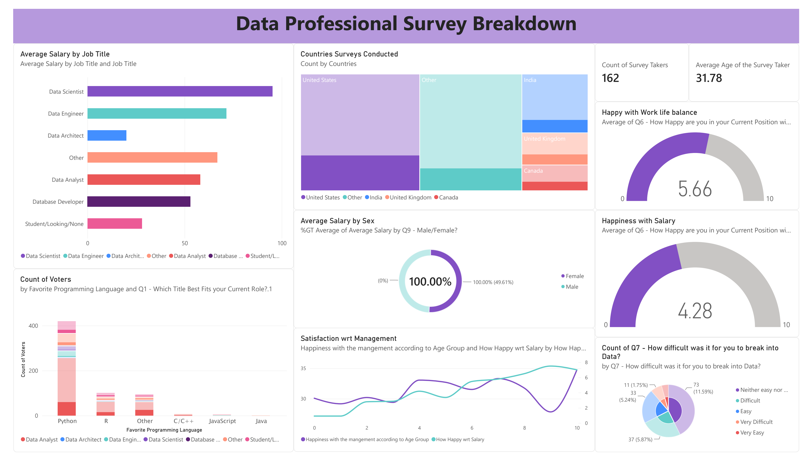

# Data Professional Survey Dashboard — Power BI

An interactive Power BI dashboard analysing survey data from 630 data professionals worldwide.

## What it shows

- **Average salary by job title** (Data Scientist earns highest, followed by Data Engineer)
- **Geographic breakdown** of survey respondents (US, India, UK, Canada)
- **Work-life balance satisfaction** score: 5.66 / 10
- **Happiness with salary** score: 4.28 / 10
- **Favourite programming languages** by job title (Python dominates)
- **Average age** of survey takers: 31.78 years
- **Difficulty breaking into data** — majority found it difficult or very difficult

## Dataset

Survey of 630 data professionals collected in 2022, covering salary ranges, job satisfaction, programming preferences, and demographics.

## Tools used

- Power BI Desktop
- Power Query (data cleaning and transformation)
- DAX (calculated measures)

## Key insights

- Data Scientists earn the highest average salaries by a significant margin
- Python is the overwhelming favourite programming language across all roles
- Work-life balance (5.66/10) rated higher than salary satisfaction (4.28/10)
- Over 60% of respondents found breaking into data difficult or very difficult
- United States accounts for the largest share of survey respondents
